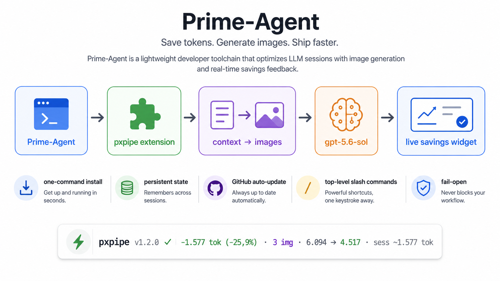
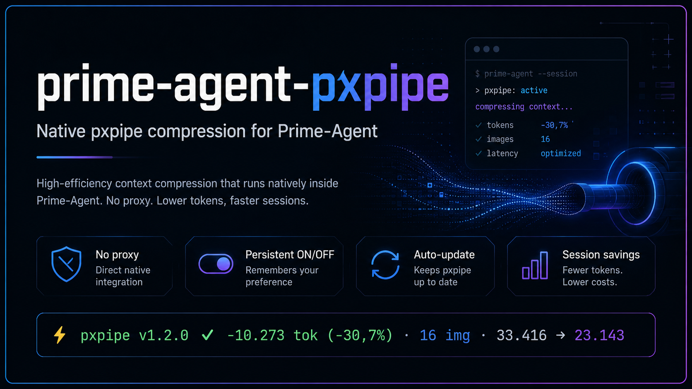

# prime-agent-pxpipe

<p align="right"><a href="README_IT.md">🇮🇹 Leggi in Italiano</a></p>

> Native **pxpipe** context compression for **Prime-Agent** — no external proxy, no `warp`, no provider swap.

<p align="center">
  
</p>

<p align="center">
  <strong>Compress large Prime-Agent context natively.</strong><br/>
  Keep your normal OAuth/provider flow while getting persistent ON/OFF state, live savings, GitHub auto-update, and convenient slash commands.
</p>

<p align="center">
  <a href="#-one-command-install">Install</a> •
  <a href="#-commands">Commands</a> •
  <a href="#-auto-update">Auto-update</a> •
  <a href="#-complete-uninstall">Uninstall</a> •
  <a href="#-report-a-bug">Bug reports</a>
</p>

---

## ✨ What it does

`prime-agent-pxpipe` integrates **pxpipe** directly into Prime-Agent's provider request lifecycle through `before_provider_request`.

It:

- intercepts the provider payload;
- compresses eligible bulky context with `pxpipe-proxy`;
- returns the transformed payload to Prime-Agent;
- keeps your existing OAuth/provider authentication untouched;
- requires no external HTTP proxy;
- shows a live widget with estimated token savings, image count, and session totals;
- stays **fail-open**: if pxpipe or the updater fails, Prime-Agent can continue with the original request.

---

## 🚀 Highlights

- ✅ **one-command GitHub install**
- ✅ `gpt-5.6-sol` enabled by default
- ✅ persistent global **ON/OFF** state
- ✅ one in-place widget below the editor, updated after the AI response
- ✅ session statistics survive `/reload` and resume
- ✅ **GitHub auto-update** for unpinned Git installs
- ✅ top-level `/pxpipe-*` aliases for Prime-Agent autocomplete compatibility
- ✅ `/pxpipe-uninstall` + `uninstall.sh` for complete removal
- ✅ fail-open behavior so compression/update failures never block inference

---

## 🖼️ Architecture

<p align="center">
  
</p>

```text
Prime-Agent
    ↓
before_provider_request
    ↓
pxpipe-proxy
    ↓
transformed context
    ↓
provider / gpt-5.6-sol
    ↓
AI response + savings widget
```

---

## 📦 One-command install

```bash
prime-agent package install git:github.com/SiNaPsEr0x/prime-agent-pxpipe
```

Then start Prime-Agent normally:

```bash
prime-agent
```

`pxpipe` starts **ON by default**.

### Install while Prime-Agent is already open

If your build supports the `!` shell prefix:

```text
!prime-agent package install git:github.com/SiNaPsEr0x/prime-agent-pxpipe
/reload
```

### Local development install

```bash
git clone https://github.com/SiNaPsEr0x/prime-agent-pxpipe.git
cd prime-agent-pxpipe
./install.sh
```

---

## ⚡ Live widget

Typical example:

```text
⚡ pxpipe v1.2.0 ✓ -1,577 tok (-25.9%) · 3 img · 6,094 → 4,517 · sess ~1,577 tok
```

With larger tool/history context:

```text
⚡ pxpipe v1.2.0 ✓ -10,273 tok (-30.7%) · 16 img · 33,416 → 23,143 · sess ~10,273 tok
```

The displayed saving is an **estimate** based on `baselineImagedTokens`, `imageTokens`, and `nativeInjectedTokens`. It is not a billing guarantee.

---

## 🕹️ Commands

| Command | Action |
|---|---|
| `/pxpipe` | status + help |
| `/pxpipe on` | enable and persist state |
| `/pxpipe off` | disable and persist state |
| `/pxpipe status` | session + update statistics |
| `/pxpipe update` | force an update check now |
| `/pxpipe autoupdate on` | enable auto-update |
| `/pxpipe autoupdate off` | disable auto-update |
| `/pxpipe autoupdate status` | show auto-update state |
| `/pxpipe bug` | show GitHub Issues URL |
| `/pxpipe uninstall` | start complete removal |
| `/pxpipe help` | full help |

### Top-level autocomplete aliases

```text
/pxpipe-on
/pxpipe-off
/pxpipe-status
/pxpipe-update
/pxpipe-autoupdate
/pxpipe-bug
/pxpipe-uninstall
/pxpipe-help
```

---

## 🔄 Auto-update

For **unpinned Git installs**, auto-update is **ON by default**.

Behavior:

- checks GitHub at most once every **24 hours**;
- only accepts **fast-forward** updates;
- never overwrites a divergent local checkout;
- GitHub/network failures do not prevent the plugin from loading;
- if dependencies changed, it runs `npm install`;
- update failures are fail-open and must not block Prime-Agent inference.

Manual check:

```text
/pxpipe-update
```

Environment overrides:

```bash
PRIME_PXPIPE_MODELS=gpt-5.6-sol,gpt-5.5 prime-agent
PRIME_PXPIPE_AUTO_UPDATE=0 prime-agent
PRIME_PXPIPE_UPDATE_INTERVAL_HOURS=6 prime-agent
```

Persistent state is stored in:

```text
~/.prime/agent/pxpipe-state.json
```

---

## 🧹 Complete uninstall

From inside Prime-Agent:

```text
/pxpipe-uninstall
```

The helper performs a best-effort removal of:

- the Prime-Agent package registration;
- `~/.prime/agent/pxpipe-state.json`;
- the local package directory.

If the TUI remains open, exit and restart Prime-Agent.

From a terminal:

```bash
./uninstall.sh
```

---

## 🐞 Report a bug

Inside Prime-Agent:

```text
/pxpipe-bug
```

When opening an issue, please include:

1. Prime-Agent version;
2. OS / WSL / Linux distribution;
3. model id;
4. `/pxpipe-status` output;
5. minimal reproduction steps;
6. expected behavior;
7. actual behavior.

> Never post API keys, OAuth tokens, secrets, private prompts, or sensitive tool output in a public issue.

---

## 🧩 Project structure

```text
prime-agent-pxpipe/
├── assets/
│   ├── hero-banner.png
│   └── workflow-overview.png
├── extensions/
│   └── pxpipe.js
├── lib/
│   ├── runtime.js
│   ├── state.js
│   └── updater.js
├── .github/
│   ├── ISSUE_TEMPLATE/
│   └── workflows/
├── install.sh
├── uninstall.sh
├── publish.sh
├── package.json
├── README.md
└── README_IT.md
```

---

## 📌 Compatibility

Tested target environment:

- Prime-Agent `0.7.2`
- Node `>=20`
- WSL / Linux
- `pxpipe-proxy` `0.13.x`
- default model: `gpt-5.6-sol`

---

## ⚠️ Precision caveat

pxpipe context-to-image compression is **lossy**. It works well for large history, descriptive text, tool output, and bulky context, but it is not ideal when character-perfect precision is required for:

- hashes;
- secrets;
- byte-perfect identifiers;
- dense exact values;
- strings where every character matters.

---

## 🤝 Contributing

See [CONTRIBUTING.md](CONTRIBUTING.md).

## 🙏 Acknowledgements

Special thanks to the developers of [Prime-Agent](https://github.com/PrimeIntellect-ai/prime-agent) and [pxpipe](https://github.com/SiNaPsEr0x/pxpipe) for their magnificent software and for making this integration possible.

## 📄 License

MIT — see [LICENSE](LICENSE).
